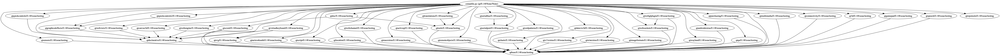

# conan-qt-modular

Conan packages for a modular library (Qt). This is just a POC (it doesn't build Qt libraries... yet)

The idea that supports this POC is to compile just once all the Qt libraries for each configuration
(this is done into the `qt_all` package) and then each other recipe is just repackaging libraries
from that one. There is also a `qt` package that allow the consumer to choose which libraries to
use using options, but as it is a header only that requires the other libraries there won't be
combinatorial explosion and we won't waste time compiling from sources again.

Have a look at the dependency graph:



## Usage

Generate all the recipes from templates and create them (use `jobs.sh` script):

```
python generate_recipes.py
./jobs.sh
```

Move to `examples` directory and work with Conan as usual:
 * `consume_intermediate` contains an example using the intermediate Qt libraries:
 
    ```txt
    [requires]
    qtwebglplugin/0.1@issue/testing
    qtsensors/0.1@issue/testing

    [generators]
    cmake

    ```
 * `consume_qt` contains an example where the libraries are consumed using the single `qt` package:
 
    ```txt
    [requires]
    qt/0.1@issue/testing

    [options]
    qt:qtwebglplugin=True
    qt:qtsensors=True

    [generators]
    cmake

    ```
